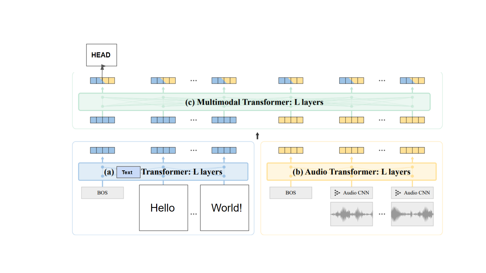

# ATBERT: Multi-modal transformer architecture for music classification
 Since **music** can be classified based on genre, beats, themes, etc. and it is difficult to obtain huge labelled data (for supervised DNNs to work), a **self-supervised** (to learn music representation with limited labelled data) **multi-modal** (multiple inputs from similar distributions is similar to more data) **transformer** (to tackle long range sequence dependence; parallelizable, reduced computations) is proposed.

Two recent papers that were referenced for this work (ATBert): Parameter Efficient Multimodal Transformers for Video Representation Learning ([AVBert](https://arxiv.org/abs/2012.04124)) and [MusicBERT](https://dl.acm.org/doi/10.1145/3474085.3475576): A Self-supervised Learning of Music Representation. ATBert (refer pic below) is elicited majorly from AVBert and experimentation results from that paper are referenced to validate choices.

The above model architecture is inspired from **AVBert**. Modalities could be fused at different levels: early (multi-modal transformer just after audio-CNN), mid (ATBert, AVBert), late (2 uni-modal transformers). Intuitively, an initial common encoder backbone might find it tough to process relatively-raw encoded multi-modal inputs. **Mid-fusion** approach enjoys three advantages: 
1. learning cross-modal relationship after uni-modal encoders project data to a common sub-space
2. Being robust to missing modalities, achieving overall the best performance (empirical from AVBert)
3. Flexibility to either pre-train the entire model from scratch or train only multi-modal transformer while using pre-trained BERT (text)/ MusicBERT (audio; has it's own "alignment task and reconstruction" pre-training task) weights which may be sub-optimal (previous work in multimodal visual-and-language tasks point out that using partially fixed Transformers of different modalities is detrimental to multimodal representation learning) but saves on resources.

Audio is pre-processed to **log-mel-scaled spectrograms** (as done in most of the recent works on audio to capture both analog frequency, time content) after which it is passed through a **ResNet-50 CNN** to generate local audio embeddings (as mel spectrums have local inductive bias like images). Same ALBERT-base encoder for 2 uni-modal (audio, text), 1 multi-modal (audio-text) encoding is used to reuse some parameters and reduce resource requirement (as compared to BERT). **Learnable positional embeddings** are used for all encoder inputs and modalitity-specific embeddings are used for multi-modal encoder input.

As in AVBert, **Correct Pair Prediction (CPP)** is used to help model learn cross-modal dynamics. Model tries to predict whether a pair of audio-text embeddings corresponds to the same music or different. One binary classifier which takes in audio-text summary embedding (first output token of multi-modal encoder) and a random-time multi-modal encoder output (empirically validated in AVBert) are passed through an external 2 layer, non-linear head to classify. Class imbalance is avoided.

Additionally, an interesting **Info-Noise-Contrastive-Estimation (InfoNCE)** loss is also used in AVBert where a audio-text pair (with a masked input token) is classified into positive/negative class (self created) where negative classes are sampled from a mini-batch based on a novel CANS-Similar (l2 norm based) method. But InfoNCE loss wasn't implemented here due to lack of proper parallelized implementation description in paper and lack of time.

Hyper parameter tuning wasn't the main focus. "**Common-voice**" (small Swedish corpus) dataset was used to pre-train the model as it contains both text, audio (and other meta-data) data (but speeches). For fine-tuning, a bi-layer, non-linear head was used to classify audio+text based on genre (small available labelled data) where labels were randomly generated, just to illustrate the flow.

## Dependencies
1. torchaudio 0.9
2. python 3.6+
3. pytorch 1.11+
4. `sentencepiece`, `transformers`, `datasets` libraries

## Using the code
A single Jupyter notebook `ATBERT_music_classifier.ipynb`, downloads, pre-processes the dataset, builds, pre-trains, fine-tunes and evaluates the transformer model. It's parameters can be easily modified and the whole setup can be easily ported to run with public-cloud like GCP, AWS, etc. or `google-colab`.

## Additional resources
1. [Metrics](https://colab.research.google.com/drive/1BnJIQc9pcxTiRYlGjnFQoMJBKU_xjxHy?usp=sharing)

